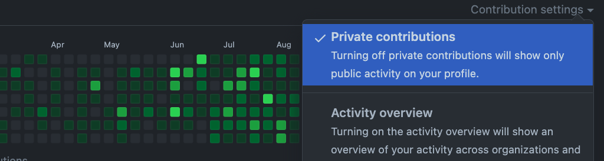
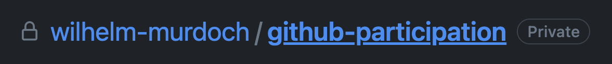
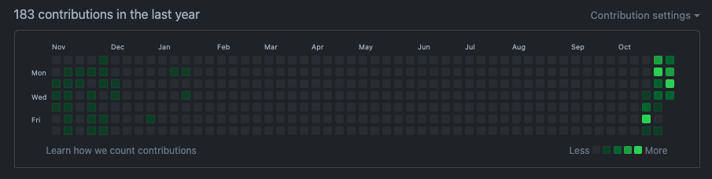
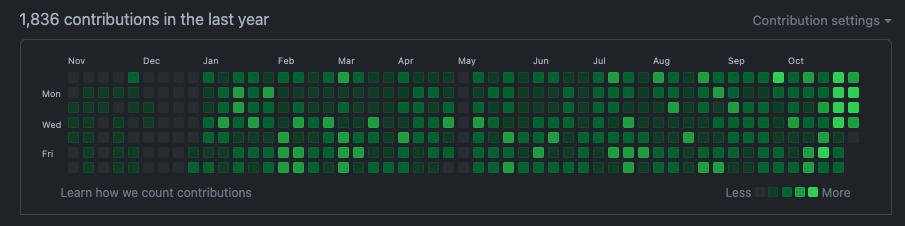

If you've spent any time job hunting in the tech industry, you've had to deal with recruiters. I like to joke around with my peers about how they're a necessary evil, but in all seriousness, great recruiters are worth their weight in gold. However ...

<!--more-->

But, good or bad, far too many of them will pass over your resume for the wildest reasons. We're not here to go over all of them. No, today we're going to address the somewhat recent trend of glancing at your public Github profile page and grading you based on how many green squares show up in your participation graph.

## What's your point? 

Like basing your performance on LoC, using "commits made" as a recruiting metric is beyond useless. There can be any number of reasons why your graph isn't as populated as they'd like:

1. You work on private repositories and you haven't configured your profile to show anonymised private contributions.
2. You have an alternate account from your personal one to keep work and private life separate. Or, maybe it's just company policy.
3. You've signed an NDA and can't publish your contributions publicly.
4. You set personal boundaries for your work-life balance and don't care to stare at glowing rectangles in your free time.
5. Or, maybe you've just had a slow year? 🤷

Personally, I have _thousands_ of commits that will never see the light of day for some of the ☝️ points. If I'm out job hunting, I would hate to be passed over because I don't tick some mundane box on an arbitrary checklist.

## What to do?

Well, we light up that graph like it's a switch board, of course. Make this information utterly useless. What do they care if your profile says you've had `2,345` commits in the last week? Maybe you did. If it's 🟩 , they cross it off their checklist and move on to something else.

## Ok, show me. 

Crack your knuckles and get ready to do some coding. For this little project, we'll be doing some simple Bash scripting. I'm currently working on MacOS, but this code should be fairly portable on other Linux-based distributions.

You will, naturally, need a Github account. Let's start there.

### Configure Your Participation Graph

Did you know you can configure your participation graph to display anonymised private commit statistics? Ensure that setting is ✅ and move on to the next step.



### New Private Repository

Let's create a new _empty_ repository entitled `graph-participation` and make sure it's private.



### Checkout Local Working Copy

Follow the post-setup instructions Github gives you to check out a local working copy of your new 🔒 repository!

```bash
echo "Let's goooooooo!" >> README.md
git init
git add README.md
git commit -m "The first and final legitimate commit in this repository ..."
git branch -M main
git remote add origin git@github.com:<account>/github-participation.git
git push -u origin main
```

Of course, replace `<account>` with the name of your Github account.

### Writing Some Code

Here comes the best part! What, you didn't think you'd walk away from this article without writing a bit of code, did you? 

This script is super-simple. There's no need for elegance here as we're probably only ever going to run this code once or twice. I'll show you the full snippet and then walk you through the details.

```bash
start=2021-05-01
stop=2021-05-09
max=20
while [[ "${start}" != "${stop}" ]]; do 
  start=$(gdate -I -d "${start} + 1 day")
  for ((run=1; run <= $((RANDOM % max + 1)); run++)); do
    openssl rand -hex 32 > touch.txt
    git add -A
    export GIT_AUTHOR_DATE="${start}T00:01"
    export GIT_COMMITTER_DATE="${GIT_AUTHOR_DATE}"
    git commit -m "Touch #${run} for ${GIT_AUTHOR_DATE}"
  done
done
```

First things first, we only need to know three things to get started:

1. `start`: The day of our first "commit" in the format of `YYYY-MM-DD`.
2. `stop`: The day of our last "commit" in the format of `YYYY-MM-DD`. 
3. `max`: We don't want a single commit per day. Otherwise, the graph will be all one colour and not at all random enough to look legitimate. So, to account for this, we randomly create between `1` and `20` commits per day.

We start a `while` loop that keeps going until our `start` and `stop` strings are no longer different. With each iteration, we add `1` day to our `start` variable. Eventually, this date will increment until both `start` and `stop` strings are equal, thus ending the loop.

For each day iteration, we create another loop that randomly-iterates anywhere between `1` and `max` times. Within each nested iteration we replace the content of the file named `touch.txt` with a random value making it a unique commit.

We then stage this change and assign a date value to both the `GIT_AUTHOR_DATE` and `GIT_COMMITTER_DATE` environmental variables. These are what allow you to easily back date a commit.

Finally, we commit this unique change locally. This keeps happening for every day until the script stops. 

Write this to an executable file, or just paste it into your terminal of choice and hit `enter`. If you see the following kind of log output, you know you're doing the right thing:

```bash
[main 2ebb5b9] Touch #1 2021-05-07T00:01
 1 file changed, 1 insertion(+), 1 deletion(-)
[main e104b0a] Touch #2 2021-05-07T00:01
 1 file changed, 1 insertion(+), 1 deletion(-)
[main 873fa39] Touch #3 2021-05-07T00:01
 1 file changed, 1 insertion(+), 1 deletion(-)
[main 9def564] Touch #4 2021-05-07T00:01
 1 file changed, 1 insertion(+), 1 deletion(-)
[main 1b83187] Touch #1 2021-05-08T00:01
 1 file changed, 1 insertion(+), 1 deletion(-)
[main b9f00db] Touch #2 2021-05-08T00:01
 1 file changed, 1 insertion(+), 1 deletion(-)
```

Now, you simply have to push all your changes up to your repository on Github!

```bash
git push origin main
```

All you now have to do is sit back and wait for everything to update. 

We've gone from barren landscape:



To a verdant garden paradise:



And that's it! 🎉

If you've made a mistake, simply delete your private repository and try again with a fresh one.

## Any final thoughts? 

Job hunting is hard enough. Especially with more and more companies becoming increasingly risk-averse in their interviewing and recruiting processes. It's my hope that this little bit of harmless mischief will make things a bit easier for you! 