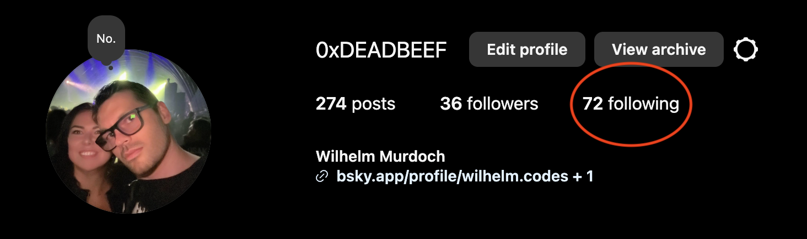
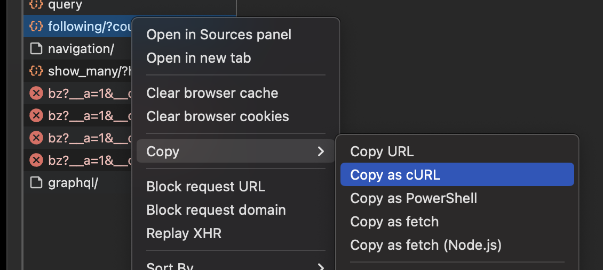
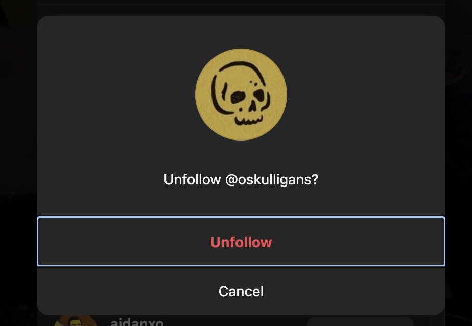
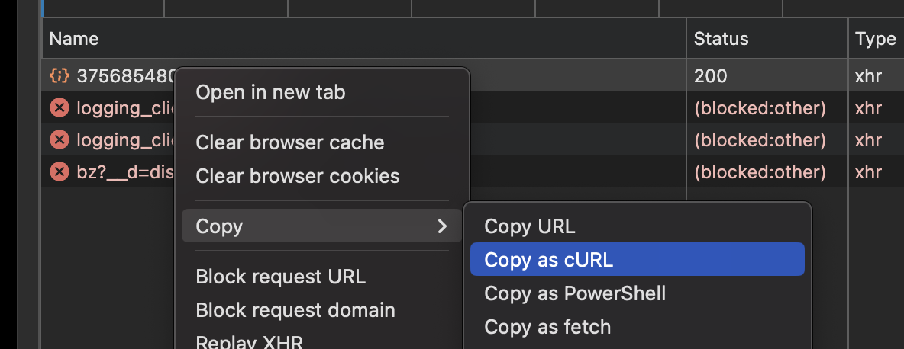

I'm not super-active on Instagram these days and Threads was a real let down. I have a dormant Mastodon account, but find myself being quite happy on [Bluesky](https://bsky.app/profile/wilhelm.codes) at the moment. Who knows how long that will last. Having recently read about Meta creating loads of [fake AI-based accounts](https://www.404media.co/metas-ai-profiles-are-indistinguishable-from-terrible-spam-that-took-over-facebook/), I thought it was time to do some spring cleaning.

<!--more-->
## Before we begin

Today, I went ahead and made my Instagram profile private. I have no desire to delete my posts just yet, but decided to go ahead and unfollow everyone as a start. There are several ways to do this:
- API calls using an SDK, which requires a developer account.
- Manually deleting "handraulically" via the native app or browser, but that can quickly become tedious if you have more than a hundred or so follows.
- Random "GreaseMonkey" scripts off the web that may, or may not, work properly if at all.
- Reverse-engineering XHR calls from your browser and writing a simple Bash script to automate the process.

If you've read some of my [previous](/blog/why-cant-i-hold-all-these-slack-emojis/) [blog](/blog/liberating-custom-slack-emojis/) [posts](/blog/falsifying-github-participation-graphs-for-fun-and-profit/), you probably can guess which one I'll be going with.
### Requirements

This guide assumes you have _some_ programming or scripting knowledge.

You will need the following on your machine:
- A shell terminal with Bash, or ZSH, support.
- `curl` to make API calls from the command line.
- `jq` to easily parse JSON-based responses from said API calls. This can easily be installed using [Homebrew](https://brew.sh/) or some other supported package manager.
- A modern browser that supports a developer tools console to intercept XHR calls.

It's worth mentioning that I am using a MacBook with the Chrome browser, but other webkit-based browsers should support similar functionality.

## Fire up the browser!

Open up your browser, or new tab, and navigate to your Instagram profile. Open your browser's developer console and navigate to the "Network" tab. Clear out whatever requests are currently listed and then filter by "Fetch/XHR".

### Your following list

We need to intercept an XHR request that returns a JSON body containing some of your followers. Click the "following" link and monitor the resulting requests that pop in the list on the "Network" tab.



You _should_ see something like `following/count=12...` in the list. Right-click that item and select "Copy as cURL". Paste the new value in your clipboard into a scratch file for reference later.



Be aware this command will contain all the headers required to make requests from your terminal on your behalf. Do NOT share these details with anyone. I haven't checked how long until the tokens within the auth headers expire, so assume they are long(ish)-lived and treat them accordingly.

### An unfollow request

Next, we need to intercept an XHR request to _unfollow_ someone. Going back to your following list, select a random user and unfollow them while once again keeping an eye on the "Network" tab.



You're going to see something like the following; an XHR event making a `POST` request to "destroy" your chosen follower. Once again, you'll right-click and "Copy and cURL". Paste this into your scratch file as well for future reference.



## Putting it all together

Now that you have your two types of requests, we'll need to script the following steps:
- Execute a `curl` request to fetch a JSON body containing the accounts you follow, one page of results at a time.
- Use `jq` to extract their Instagram IDs.
- Store the results in a variable named... drumroll, pls... `$ids`.
- Iterate through each `$id`.
- Execute a `curl` request to unfollow each `$id`.

Here is the meat of the script. I have included only the necessary headers required to successfully make these requests on your Instagram account's behalf. You'll need to swap out the `...` with your own values.

You may also notice that I've change the `count=...` parameter to `100`. It may be able to go higher, but I haven't tested it.

```bash
ids=$(
  curl 'https://www.instagram.com/api/v1/friendships/.../following/?count=100&hl=en' \
    -H 'cookie: ...'           \
    -H 'x-asbd-id: ...'        \
    -H 'x-csrftoken: ...'      \
    -H 'x-ig-app-id: ...'      \
    -H 'x-ig-www-claim: ...'   \
    -H 'x-requested-with: ...' \
    -H 'x-web-session-id: ...' | jq -r '.users[].id'
)

while IFS= read -r id; do
  echo -n "Unfollowing user '${id}'"

  curl -s -o /dev/null "https://www.instagram.com/api/v1/friendships/destroy/${id}/?hl=en" \
    -H 'cookie: ...'           \
    -H 'x-asbd-id: ...'        \
    -H 'x-csrftoken: ...'      \
    -H 'x-ig-app-id: ...'      \
    -H 'x-ig-www-claim: ...'   \
    -H 'x-requested-with: ...' \
    -H 'x-web-session-id: ...' \
    --data-raw "container_module=profile&nav_chain=PolarisProfilePostsTabRoot%3AprofilePage%3A1%3Avia_cold_start%2CPolarisProfilePostsTabRoot%3AprofilePage%3A2%3Aunexpected&user_id=${id}"

  echo ' ... done!'
done <<< "${ids}"

echo "Finished"
```

You can save this as a file and make it executable, but I just paste this bad boy into your terminal. The above script will remove `100` accounts at a time. Just keep executing the script until you no longer see results like the following:

```text
Unfollowing user '111'... done
Unfollowing user '222'... done
Unfollowing user '333'... done
Unfollowing user '444'... done
Unfollowing user '555'... done
Unfollowing user '666'... done
Unfollowing user '777'... done
Unfollowing user '888'... done
Finished
```

### Caveats, gotchas & other things
I've only had a few hundred accounts that I followed, so I didn't feel the need to make this a bullet-proof solution. There's quite a bit missing and things can go wrong. Here are some things to consider off the top of my head :
- The session tokens will expire eventually, so you will have to refer back to your "Network" tab in your developer tools console to get new ones. 
- As this example only unfollows a static amount at a time, re-executing the script may become tedious for very large follow numbers. Perhaps, you can modify this script to add some basic pagination.
- There is no error handling here, so keep an eye out for potential rate limiting or expired token issues with the Instagram API.
- Constantly updating session header values can be made a bit simpler by resorting to variables instead.
## In closing ...
Cleaning out old, unused or unwanted social media accounts can be liberating. I've recently gutted my Twitter presence and I haven't been on Facebook in years, though I still do use Messenger to keep in touch with a handful of people. I'd prefer using Signal for this, but trying to convince other people to install yet another messaging app is like pulling teeth.

Anyway, I actually enjoy writing these kinds of posts. What other social networks should I cover? LinkedIn? Threads? What are some ways you can improve and build on the above? Lemme know in the comment section below.