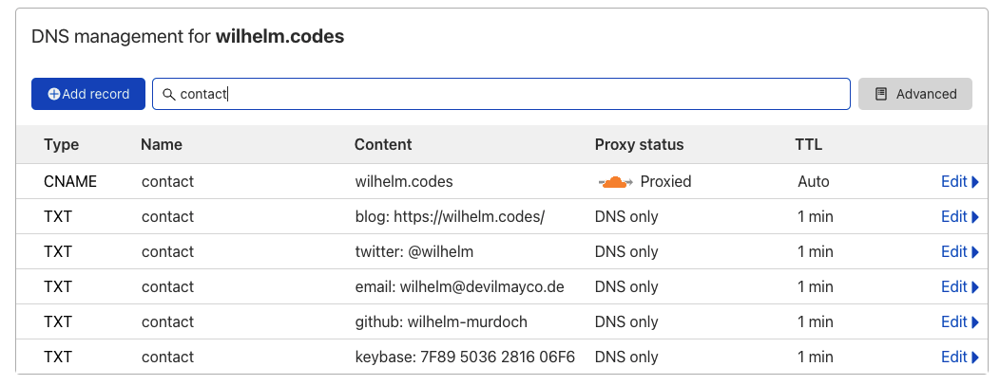

If you've spent any time in an ops-related position, you've had to add these records when using custom domain names while integrating with some 3rd-party service. Especially, if you've ever wanted to configure an email service provider, like Google's Gmail, to appear as if you're sending emails from a personal domain name.

<!--more-->

## Wanna see a neat trick?

Open up your terminal of choice and invoke this `dig` command:

```bash
dig txt contact.wilhelm.codes +short
```

You should see, hopefully 🤞, the following block of text as a response:

```text
"twitter: @wilhelm"
"github:  wilhelm-murdoch"
"keybase: 7F89 5036 2816 06F6"
"blog:    https://wilhelm.codes/"
```

## What you're looking at.

Simply put, you're looking at my contact details using a simple DNS `TXT` record lookup. There are [heaps](https://dns.google/query?name=contact.wilhelm.codes) [of](https://toolbox.googleapps.com/apps/dig/#TXT/) [online tools](https://www.diggui.com/) out there to help you directly query DNS records, but `dig` tends to be the most common utility included included in most Linux distributions as well as MacOS.

## Why might you do this?

Originally, `TXT` records were meant to allow DNS administrators to attach simple plain text human-readable "notes" to their zones. A bit later, it became common practice to use this flexible record type as a way to verify ownership of a domain.

If you've spent any time in an ops-related position, you've had to add these records when using custom domain names while integrating with some 3rd-party service. Especially, if you've ever wanted to configure an email service provider, like Google's Gmail, to appear as if you're sending emails from a personal domain name.

So, why not also create personal, human-readable way of declaring ownership over a domain as well? Like a globally-accessible low-tech "business card".

DNS is effectively a globally-distributed, (mostly) fault-tolerant, eventually-consistent key / value store. These details can be easily looked up and verified by anyone with an Internet connection. 

And as for "Why?", why not?

## Here's you would implement it.

Honestly, there's nothing special about how to implement this. It's just another record. In my case, I ended up creating a separate `TXT` record _per_ contact detail. Depending on which server software your DNS provider is using, you may or may not be able to create multi-line text blocks. So, your safest bet is just multiple one-liners attached to the same `CNAME`.

I recently migrated my zone for `wilhelm.codes` from [Vultr](https://www.vultr.com/) to [CloudFlare](https://www.cloudflare.com/) and this is pretty much what it all looks like:



Obviously, this interface will be different if you use a different service, but that's all there is to it!

## That's it!

Yep. This isn't groundbreaking stuff and I'm surely not the first person to do something like this. Just a bit of (mostly) harmless DNS fun!