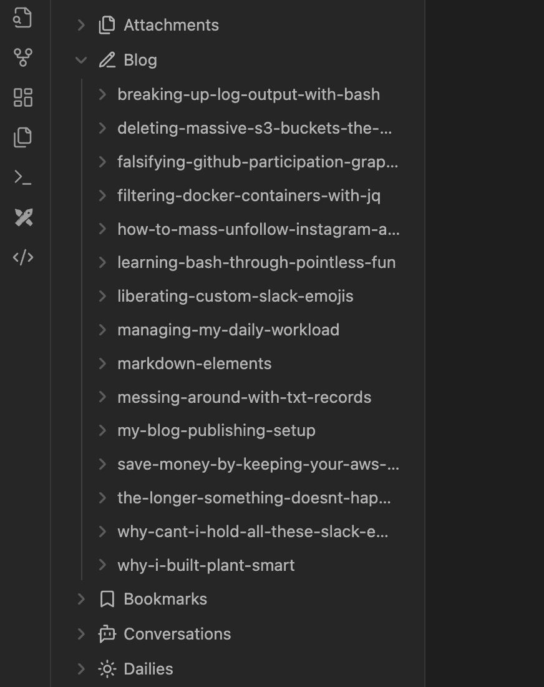
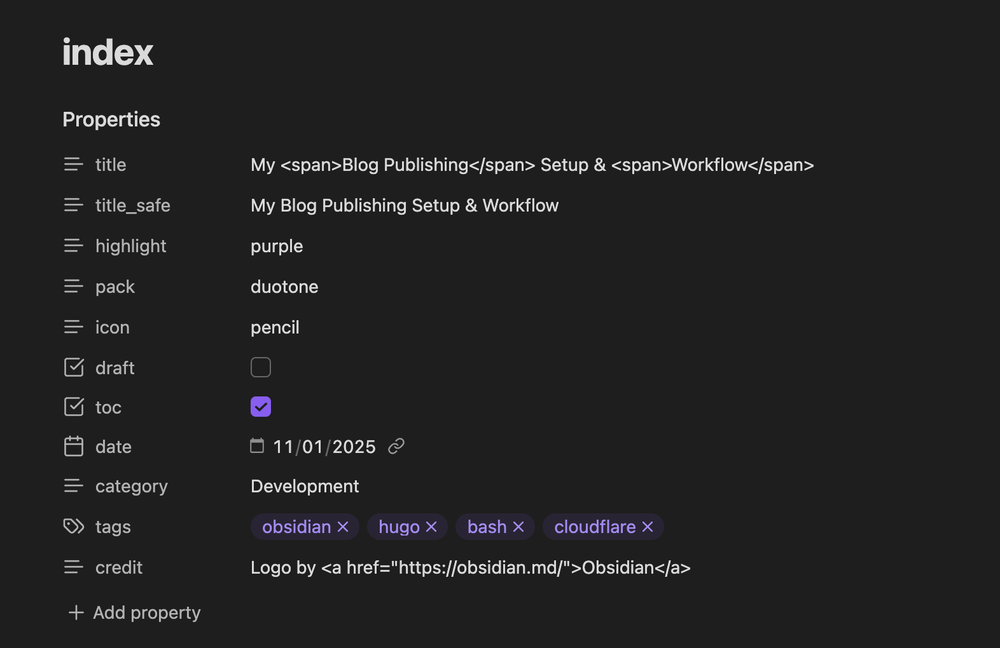

Late last year I parted ways with [Hashnode](https://hashnode.com/) as the platform of choice for my blog. They pivoted a bit too far into the generative AI space which —  to me for a blogging platform —  made little to no sense. What? You write your content with AI, which then trains their model only to spit out more AI-generated slop?  A slop-based [Ouroboros](https://en.wikipedia.org/wiki/Ouroboros), if you will. Good luck with that, but I'll pass thanks.

<!--more-->

## First, a Small Rant

Before you call me a [Luddite](https://en.wikipedia.org/wiki/Luddite), let's be clear here, I don't have an issue with the technology itself. I'm an engineer. I think it all has its uses, but force-feeding it into almost every aspect of our lives with no regard to any social and environmental impacts with frequently no chance of being able to easily opt-out does not sit right with me one bit.

We've seen this happen over the last decade with touchscreens, IoT, blockchain, NFTs, Web3 the list goes on. All promoted by the endless parade of interchangeable, nameless faceless talentless hacks and disingenuous grifters who only care about making "BIG LINE GO UP".

It's all so tiring, so perhaps you can understand why I'd immediately recoil in disgust and go my own way with an alternative I can control.

Or, to put it in even simpler terms:


## The "Stack"
I suppose it's technically a "stack", but it seems a bit funny to use the term when referencing a blog setup. Just as with my [Plant Smart](https://plantsm.art) project, the goal is to automate as much as possible while keeping maintenance requirements and hard- and soft-dollar costs as low as possible. For this, I need only use a handful of tools to keep this space operational.

As far as the question over "cost", outside of time spent, it's about ~$100 AUD per year for the domain name. This blog is a very small and inconsequential part of this domain, so the overall cost is absorbed by "other stuff".

So, the greatest cost is... time? I guess 🤷

### Obsidian
While I won't be going into what [Obsidian]() is and how it works, I will say it's been a personal boon in how I keep notes and track of ideas. I have a lot of fleeting / ephemeral thoughts I that would otherwise lose instantly if I didn't immediately jot them down using this app.

So, it makes perfect sense for me to use my personal [vault](https://help.obsidian.md/Getting+started/Create+a+vault) to store all my blog content. The fact Obsidian content nothing more than Markdown files makes working with them using other bits of tech that much easier.

Oh, it's free btw.
### Hugo
[This](https://gohugo.io/) is probably one of the more popular options when it comes to static site generators. It's easy to install, is incredibly extensible and has loads of documentation to help you along. The template syntax sits upon Golang's templating engine, so if you have a strong background as a Go developer like myself, you'll be right at home.

However, knowing Go isn't a hard requirement though it will make getting on top of things quite a bit easier.

What I enjoyed while learning about this project was I got to control every aspect of how I wanted my blog to look and function. Building the current design from the ground up with Hugo was incredibly fun.

Also, free. Very cool.
### Cloudflare
I already used Cloudflare to manage this domain's DNS settings, so it only made sense to publish my static site to Cloudflare Pages over, say, Vercel or Github Pages. There's nothing spectacular going on here outside of me just wanting to keep these two things in the same place.

That being said, I have no issues with migrating else where if the need should ever arise. Though, I doubt this blog will hit the 20k file limit of Cloudflare Pages any time soon.

Again, free for the purposes of this article. If you don't have a dedicated personal domain, you will be provided a subdomain attached to the `pages.dev` apex.
## The Good Stuff
How is this all put together for day-to-day usage? Luckily, the Cloudflare stuff runs on auto-pilot, so it's pretty much set-and-forget. I suppose you could say the same about the other components, but they're the parts I touch the most.

I have a single vault in Obsidian. It's where all my thoughts go. Stored within is a top-level `Blog/` directory. Care to hazard a guess as to what it may contain?



Hugo has the concept of [page bundles](https://gohugo.io/content-management/page-bundles/) where you can group all resources associated with your blog articles within a single directory. You'll notice above all directories mirror the blog posts hosted on this site. In my case, we can consider the directory names to be the human-friendly slugs you see in your address bar that point to the associated content. Within these directories, you'd see any other resource I may link to; source code, images, etc... The best thing about this is I only have to perform a relative reference to these resources. If I want to link to `image-1.png`, I only have to reference it as `` without worrying about specifying an absolute path; very nice.

When I want to write a new article, I first create a new directory here. I may already have the title of the article in mind, but it can be in flux until I decide to publish it. In the new directory, I create a file called `index.md`. This file contains all the content of the associated article written using Markdown.

I then use an Obsidian [template](https://help.obsidian.md/Plugins/Templates) dedicated to new blog posts and apply it to the new file. This ensures I have all [front matter](https://jekyllrb.com/docs/front-matter/) properties ready to go. This makes configuring my posts in the editor that much easier.



All that's left is writing my articles! Well, not really. I need a way to synchronise these files with my local Hugo instance. As you can see [here](https://github.com/wilhelm-murdoch/wilhelm.codes/tree/main/content/blog), the content mirrors what I have stored in my Obsidian vault. 

This can be easily addressed with 2 small apps:
1. `fswatch` which monitors a specified directory for changes and allows you to trigger subsequent commands for specific file system events. Basically, I want to watch for any changes in my Obsidian vaults `Blog/` directory. 
2. `rsync` to dynamically keep the target Hugo directory in sync with the Obsidian source directory.

I, of course, have this placed in a script that I have running in the background while I write. This is a great help during the drafting phase as I have Hugo dynamically processing and displaying these changes locally. This allows me to easily proof my work visually as I carry on writing. 

Here's the full script:
```bash
#!/usr/bin/env bash

SOURCE=${SOURCE:="${1}"}
export SOURCE

DESTINATION=${DESTINATION:="${2}"}
export DESTINATION

fswatch -o "${SOURCE}" | while read -r event; do 
    rsync -av --delete "${SOURCE}" "${DESTINATION}";
done
```

I keep this running whenever I'm writing a new article. Obsidian saves in almost realtime, so as I type the changes almost immediately sync across to the local Hugo server so I can review my changes.

You effectively run it as:
```bash
$ ./sync.sh /path/to/obsidian/blog/ /path/to/hugo/content/
```

For `rsync` to work as intended and keep the destination directory completely in sync with the source directory, remember to add a trailing slash to both directory arguments.
### No Auto-Commit?
Nope. Not here. There are a few other peeps with blogs out there that "commit on change", but I prefer to have a bit more control over what actually gets published. For that, I simply use plain-old git commands to publish my new article:

```bash
$ git add -A
$ git commit -m 'some banal new bullshit screed'
$ git push origin main
```

Cloudflare monitors the associated repository, picks up the change and the auto-magic-ally builds and pushes everything to the public eye.

With this flow, I can see my changes locally in near realtime and push to "production" only when I'm happy with the results.

## In Closing ...
I'm stoked to have my very own place again that I have complete control over. I've thoroughly enjoyed creating this new blog design and I may even open-source it one day. 

That said, I've made a very loose commitment to post a new article every week this year of our lord 2025 and I'm hoping this will make things heaps simpler. I only want to worry about what I'm going to write and just get the content out there.

I sincerely hope I can keep this self-imposed weekly commitment. 😬👍